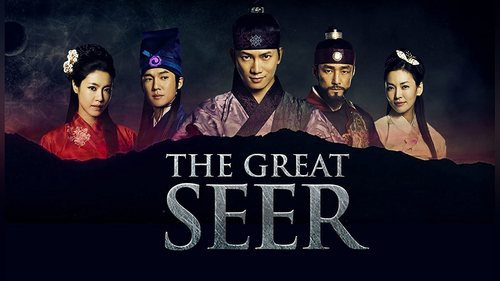
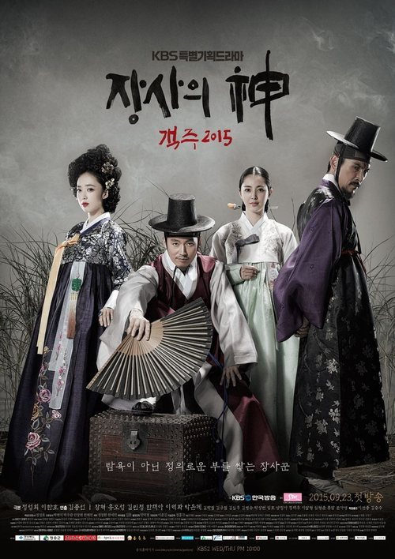
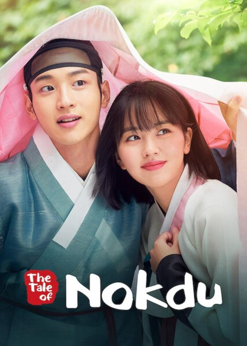
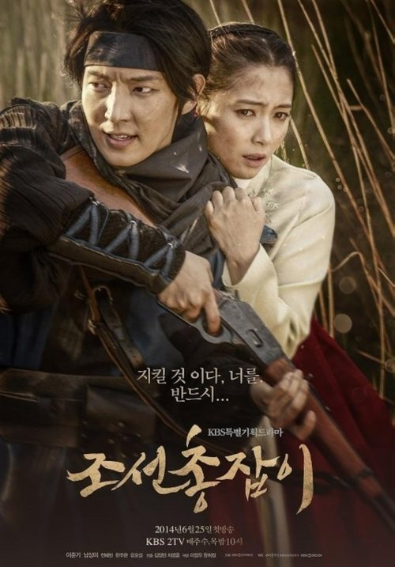
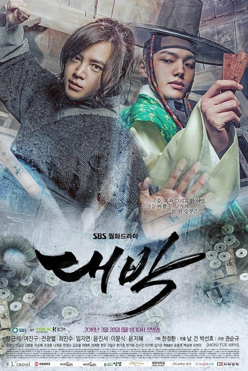

# 🏯 المسلسلات اللي شاهدتها

**27 عمل** من أصل 83 عملاً مختلفاً بالقائمة — يعني خلّصت **33%** منها.

---

## 📊 ذوقك بالأرقام

| | |
|---|---|
| **متوسط تقييم اللي شفته** | **7.97** — أعلى من متوسط القائمة كلها (7.76) |
| **أعلى عمل شفته** | اعز ما عندي ★8.9 |
| **أدنى عمل شفته** | ولي العهد المفقود ★6.9 |
| **أقدم عمل** | Jewel in the Palace (2003) |
| **أحدث عمل** | القصر الشرقي (2026) |

**ملاحظة:** ما تختار عشوائي — متوسطك أعلى من متوسط القائمة بـ0.21 نقطة، يعني عندك فلتر جودة شغّال.

### الأنواع

| النوع | شفت | من أصل | النسبة | |
|-------|:---:|:------:|:------:|---|
| دراما | 11 | 37 | 30% | `███░░░░░░░` |
| اكشن | 8 | 24 | 33% | `███░░░░░░░` |
| تاريخي | 4 | 8 | 50% | `█████░░░░░` |
| كوميدي | 3 | 10 | 30% | `███░░░░░░░` |
| مغامرة | 1 | 1 | 100% | `██████████` |
| خيالي | 0 | 3 | 0% | `░░░░░░░░░░` |
| جريمة | 0 | 1 | 0% | `░░░░░░░░░░` |
| عائلي | 0 | 1 | 0% | `░░░░░░░░░░` |
| رومانسي | 0 | 2 | 0% | `░░░░░░░░░░` |

### العقود

| العقد | العدد | |
|-------|:-----:|---|
| 2000s | 5 | `█████` |
| 2010s | 8 | `████████` |
| 2020s | 14 | `██████████████` |

---

## 🎭 نمطك — بصيغته الدقيقة

بعد ما وضّحت أكثر، النمط صار محدد جداً:

> **رجل من طبقة دنيا · انظلم ظلماً حقيقياً · بنى بيده شي عظيم لوطنه · والقصة حقيقية.**

| العمل | الصعود | البناء |
|-------|--------|--------|
| جومونك | أمير منبوذ مطارد | أسّس غوغوريو |
| الملك داي جو | جندي بعد سقوط وطنه | أسّس بالهاي |
| الجندي (Musin) | **عبد** | أقوى رجل بغوريو |
| ستة تنانين طائرة | ستة من العدم | أسّسوا جوسون |
| حرب غوريو وخيتان | — | صدّ الغزو الخيتاني |
| صائد العبيد | نبيل سقط للحضيض | — |

**والشرط اللي يفرق:** القصة تكون حقيقية. هذا اللي يخلّي الأثر يبقى بعد نهاية المسلسل.

### أعمال خارج القائمة شفتها وتؤكد النمط

- **إمبراطور البحر** (해신، 2004) — جانغ بوغو: عبد انباع للصين، رجع وسحق القراصنة اللي كانوا يستعبدون أبناء وطنه، وبنى إمبراطورية بحرية. لقّبوه «ملك البحر».
- **هيو جون** (허준، 1999) — ابن جارية صار أعظم طبيب بتاريخ كوريا وكتب «دونغوي بوغام» المسجّل باليونسكو.

👈 الترشيحات المبنية على هذا النمط بملف [`RECOMMENDED.md`](RECOMMENDED.md).

### ملاحظات ثانية

**ما تخاف من الطويل.** جومونك 81 حلقة، الملك داي جو 134، الجندي 56 — التزامات جدية وخلّصتهن.

**متوازن بالزمن.** 5 من الألفينات، 8 من العشرة، 14 من العشرينات.

**أربع أنواع ما لمستها:** خيالي، رومانسي، جريمة، عائلي.

## ✅ القائمة كاملة

مرتّبة من الأعلى تقييماً للأدنى.

| # | | العمل | السنة | ⭐ | النوع |
|:-:|---|-------|:----:|:--:|-------|
| 1 |  | **اعز ما عندي** — My Dearest | 2023 | 8.9 | تاريخي |
| 2 |  | **ستة تنانين طائرة** — Six Flying Dragons | 2015 | 8.9 | دراما |
| 3 |  | **الأكمام الحمراء** — The Red Sleeve | 2021 | 8.8 | دراما |
| 4 |  | **صائد العبيد** — Chuno | 2010 | 8.7 | اكشن |
| 5 |  | **تحت مظلة الملكة** — Under the Queen's Umbrella | 2022 | 8.5 | كوميدي |
| 6 |  | **Jewel in the Palace** — Dae Jang Geum | 2003 | 8.5 | دراما |
| 7 |  | **عهد جديد** — My Country: The New Age | 2019 | 8.3 | اكشن |
| 8 |  | **الملك داي جو** — Dae Jo Yeong | 2006 | 8.3 | دراما |
| 9 |  | **جومونك** — Jumong | 2006 | 8.3 | مغامرة |
| 10 |  | **الملكة وو** — Queen Woo | 2024 | 8.1 | اكشن |
| 11 |  | **حرب غوريو وخيتان** — Goryeo-Khitan War | 2023 | 8.1 | اكشن |
| 12 |  | **الجندي** — God of War (Musin) | 2012 | 8.1 | تاريخي |
| 13 |  | **The Tale of Lady Ok** | 2024 | 8.0 | دراما |
| 14 |  | **سو بيك هيانغ أبنة الملك** — King's Daughter, Soo Baek Hyang | 2013 | 8.0 | دراما |
| 15 |  | **The Phantom Thief** — Iljimae | 2008 | 8.0 | اكشن |
| 16 |  | **فضيحة سونغ كيونكوان** — Sungkyunkwan Scandal | 2010 | 7.8 | كوميدي |
| 17 |  | **محامي جوسون: الفضيلة** — Joseon Attorney | 2023 | 7.7 | دراما |
| 18 |  | **بوسام: سرقة القدر** — Bossam: Steal the Fate | 2021 | 7.7 | دراما |
| 19 |  | **القصر الشرقي** — The East Palace | 2026 | 7.6 | اكشن |
| 20 |  | **عزيزي هونغرانغ** — Dear Hongrang | 2025 | 7.6 | دراما |
| 21 |  | **100 Days My Prince** | 2018 | 7.6 | تاريخي |
| 22 |  | **The Murky Stream** | 2025 | 7.5 | اكشن |
| 23 |  | **بيت ضيافة رومانسي** | 2023 | 7.5 | تاريخي |
| 24 |  | **مملكة الرياح** — The Kingdom of the Winds | 2008 | 7.5 | دراما |
| 25 |  | **اغنية السيف** — Song of the Bandits | 2023 | 7.2 | اكشن |
| 26 |  | **زهرة في السجن** — Flowers in Prison | 2016 | 7.2 | دراما |
| 27 |  | **ولي العهد المفقود** — The Missing Crown Prince | 2024 | 6.9 | كوميدي |

---

## ⚙️ تفضيلاتك المسجّلة

> **بطولة نسائية مركزية:** ما تفضّلها — إلا إذا كان العمل يستاهل لأسباب قوية.
> الترشيحات تحت مبنية على هذا، والأعمال ذات البطولة النسائية معلّمة بوضوح 🚺 حتى تعرفها من أول نظرة.

**ملاحظة من بياناتك:** 8 من الـ27 اللي شفتهن بطولتهن نسائية واضحة (تحت مظلة الملكة، Dae Jang Geum، الملكة وو، Lady Ok، سو بيك هيانغ، فضيحة سونغ كيونكوان، زهرة في السجن، القصر الشرقي) — وأغلبهن من الأعلى تقييماً بقائمتك. القاسم المشترك بينهن: البطلة تصارع **نظام سياسي أو طبقي**، مو قصة حب. يمكن اللي ما يعجبك هو الرومانسية المتمحورة حول البطلة، مو البطلة نفسها. خذها كملاحظة، القرار قرارك.

---

## 🎯 شنو تشوف بعدين

### 🥇 الثلاثة الأوائل — بطولة رجالية، ملاحم سياسية

**١. Gyebaek — غيبيك** (2011) · ★7.9 · دراما · 36 حلقة  
الجنرال «غيبيك» آخر أبطال مملكة بايكجي، ومعركته الأخيرة اليائسة بـ«هوانغسانبيول» ضد جيوش شيلا والتانغ المتحالفة — 5,000 مقاتل ضد 50,000. بطولة لي سيو جين. **هذا أقرب شي لـ*جومونك* و*الملك داي جو* و*حرب غوريو وخيتان* اللي حبيتهن**: ملحمة عسكرية، بطل رجل، سقوط مملكة. بلا بطلة مركزية.

**٢. قناع العروس — Bridal Mask** (2012) · ★8.3 · اكشن · 28 حلقة  
شفت *إلجيماي*؟ هذا أخوه الأكبر والأقسى. «لي كانغ تو» شرطي كوري يخدم اليابانيين نهاراً ويطاردهم كبطل مقنّع «غاكسيتال» ليلاً — والصراع مع أخوه وضميره أثقل من صراعه مع اليابانيين. بطولة جو وون. عمل رجالي بالكامل.

**٣. Secret Door — بيميلوي مون** (2014) · ★7.3 · دراما · 24 حلقة  
المأساة الأشهر بتاريخ جوسون: الملك «يونغجو» وابنه ولي العهد «سادو» — أب يقتل ابنه بحبسه داخل صندوق أرز حتى الموت. صراع أب وابن على السلطة والفكر، مافيه رومانسية أصلاً. هان سوك كيو ولي جي هون. **تقييمه 7.3 بس هذا ظلم — هو من أثقل الدرامات السياسية بالقائمة**، بطيء ومركّز على الحوار والمؤامرة.

### 🥈 خيارات قوية ثانية (بطولة رجالية)

| | العمل | السنة | ⭐ | ليش |
|---|-------|:----:|:--:|-----|
|  | **العراف العظيم** — The Great Seer | 2012 | 7.7 | صراع عرّافين على مصير المملكة بنهاية غوريو — **نفس حقبة *ستة تنانين طائرة* بالضبط** |
|  | **The Merchant: Gaekju** | 2015 | 7.6 | صعود تاجر من الحضيض لأغنى رجل بجوسون — ملحمة اقتصادية بدل عسكرية، جانغ هيوك |
|  | **The Tale of Nokdu** | 2019 | 7.9 | بطل رجل يبحث عن سر عائلته — أخف نبرة، فيه كوميديا |
|  | **Joseon Gunman** | 2014 | 7.3 | سيّاف يمسك بندقية للانتقام بزمن انفتاح جوسون على الغرب — لي جون غي |
|  | **The Royal Gambler** | 2016 | 7.5 | مقامر شارع يكتشف إنه ابن الملك — لعبة القمار الأكبر: العرش |

### 🚺 أعمال عالية التقييم بس بطولتها نسائية

معلّمة حتى تعرفها — القرار إلك:

| العمل | ⭐ | الوضع |
|-------|:--:|-------|
| **The Great Queen Seondeok** | 8.6 | 🚺🚺 **بطولة نسائية مزدوجة** — الملكة سيوندوك ضد ميشيل، والمسلسل كله صراع بين امرأتين. أعظم عمل بالقائمة فنياً، بس أبعد شي عن تفضيلك |
| **الإمبراطورة كي** | 8.4 | 🚺 كل العمل رحلة صعود امرأة واحدة |
| **شبابنا المتفتح** | 9.1 | بطولة مزدوجة متوازنة — الأمير والمتهمة، خيط اللغز يشيل القصة مو الرومانسية |
| **Faith** | 8.6 | بطولة مزدوجة — الجنرال «تشوي يونغ» هو المحرّك، الطبيبة شريكة |
| **When Life Gives You Tangerines** | 9.3 | 🚺 حياة امرأة من الستينات لليوم — وأصلاً مو ساغوك |

## 📝 ملاحظات

- علّمت **#1 القصر الشرقي** — و**#2 The East Palace** هو نفس العمل بترجمة ثانية، فحسبته مرة وحدة.
- الأعمال المكرّرة الباقية (#40، #50، #78) ما علّمت أصولها، فهي بره حساب المشاهدة.
- **#24 بيت ضيافة رومانسي** و**#4 The Murky Stream** — علّمت إنك شفتهن، بس هما من الأعمال اللي ما گدرت أأكّد اسمها الأصلي. إذا تعرف اسمهن بالإنجليزي أو الكوري انطيني ياه وأكمّل وصفهن بالقائمة.

---

*تحديث: 2026-08-19 · 27/83 عمل · متوسط ★7.97*
