# 🏯 المسلسلات اللي شاهدتها

**27 عمل** من أصل 83 عملاً مختلفاً بالقائمة — يعني خلّصت **33%** منها.

---

## 📊 ذوقك بالأرقام

| | |
|---|---|
| **متوسط تقييم اللي شفته** | **7.97** — أعلى من متوسط القائمة كلها (7.76) |
| **أعلى عمل شفته** | اعز ما عندي ★8.9 |
| **أدنى عمل شفته** | ولي العهد المفقود ★6.9 |
| **أقدم عمل** | Jewel in the Palace (2003) |
| **أحدث عمل** | القصر الشرقي (2026) |

**ملاحظة:** ما تختار عشوائي — متوسطك أعلى من متوسط القائمة بـ0.21 نقطة، يعني عندك فلتر جودة شغّال.

### الأنواع

| النوع | شفت | من أصل | النسبة | |
|-------|:---:|:------:|:------:|---|
| دراما | 11 | 37 | 30% | `███░░░░░░░` |
| اكشن | 8 | 24 | 33% | `███░░░░░░░` |
| تاريخي | 4 | 8 | 50% | `█████░░░░░` |
| كوميدي | 3 | 10 | 30% | `███░░░░░░░` |
| مغامرة | 1 | 1 | 100% | `██████████` |
| خيالي | 0 | 3 | 0% | `░░░░░░░░░░` |
| جريمة | 0 | 1 | 0% | `░░░░░░░░░░` |
| عائلي | 0 | 1 | 0% | `░░░░░░░░░░` |
| رومانسي | 0 | 2 | 0% | `░░░░░░░░░░` |

### العقود

| العقد | العدد | |
|-------|:-----:|---|
| 2000s | 5 | `█████` |
| 2010s | 8 | `████████` |
| 2020s | 14 | `██████████████` |

---

## 🎭 شنو يقول ذوقك عنك

**١. أنت رجل الملاحم السياسية.** شفت *ستة تنانين طائرة* و*جومونك* و*الملك داي جو* و*الجندي* و*حرب غوريو وخيتان* و*الملكة وو* — كلهن ملاحم تأسيس ممالك وصراع على العرش. هذا مو صدفة، هذا نمط واضح.

**٢. التاريخي هو نوعك الأول فعلياً.** خلّصت **4 من 8** (50%) من التصنيف التاريخي — أعلى نسبة عندك بفارق كبير.

**٣. ما تخاف من المسلسلات الطويلة.** *جومونك* (81 حلقة)، *الملك داي جو* (134 حلقة)، *الجندي* (56 حلقة) — هذي التزامات جدية وخلّصتهن.

**٤. متوازن بالزمن.** 5 من الألفينات، 8 من العشرة، 14 من العشرينات — تشوف الجديد بس ما تتجاهل الكلاسيك.

**٥. عندك أربع أنواع ما لمستها أبداً:** خيالي، رومانسي، جريمة، عائلي.

---

## ✅ القائمة كاملة

مرتّبة من الأعلى تقييماً للأدنى.

| # | | العمل | السنة | ⭐ | النوع |
|:-:|---|-------|:----:|:--:|-------|
| 1 | 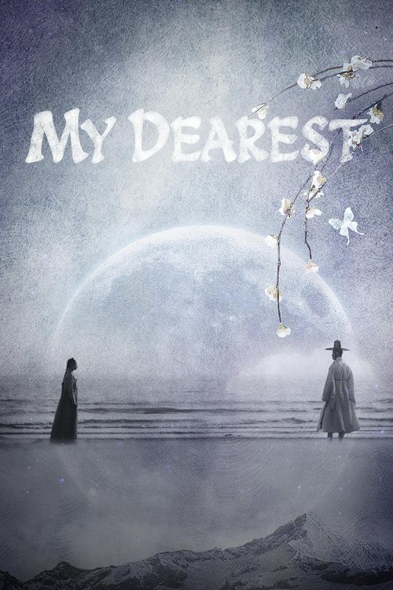 | **اعز ما عندي** — My Dearest | 2023 | 8.9 | تاريخي |
| 2 | 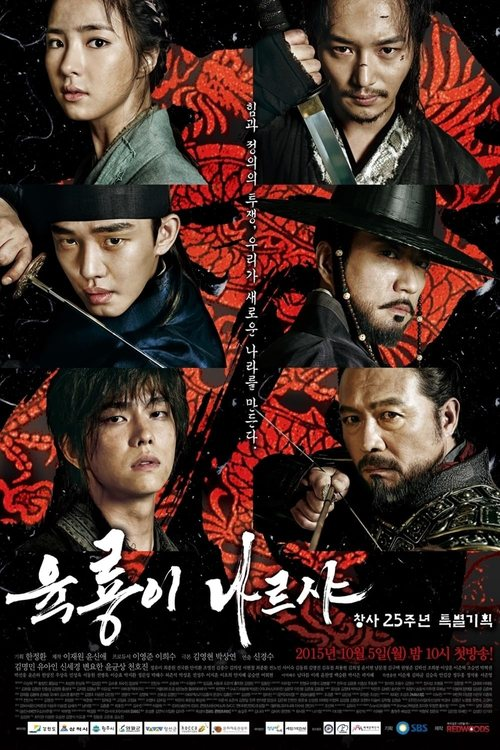 | **ستة تنانين طائرة** — Six Flying Dragons | 2015 | 8.9 | دراما |
| 3 | 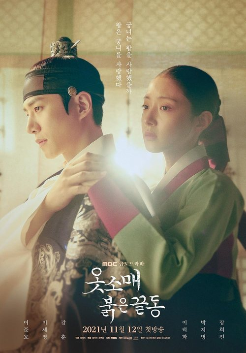 | **الأكمام الحمراء** — The Red Sleeve | 2021 | 8.8 | دراما |
| 4 | 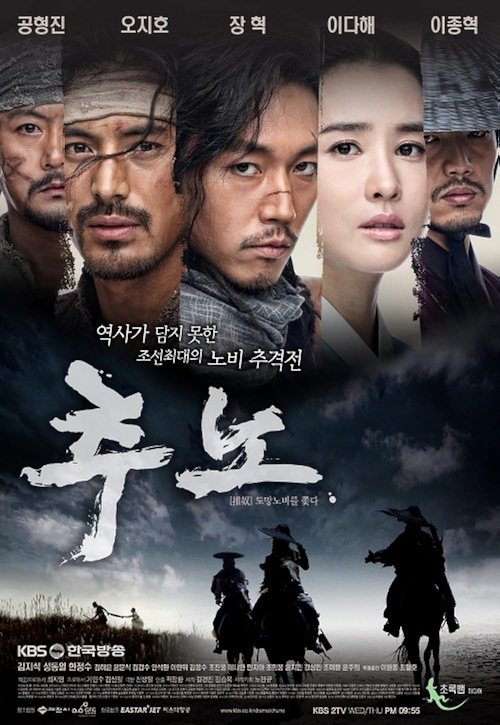 | **صائد العبيد** — Chuno | 2010 | 8.7 | اكشن |
| 5 | 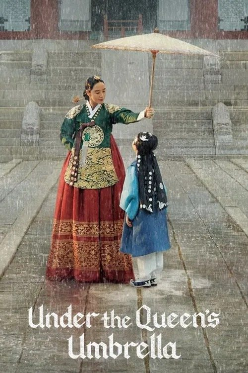 | **تحت مظلة الملكة** — Under the Queen's Umbrella | 2022 | 8.5 | كوميدي |
| 6 | 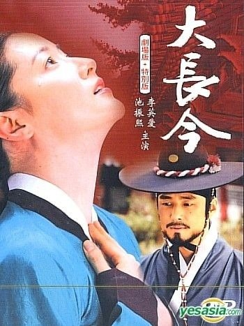 | **Jewel in the Palace** — Dae Jang Geum | 2003 | 8.5 | دراما |
| 7 | 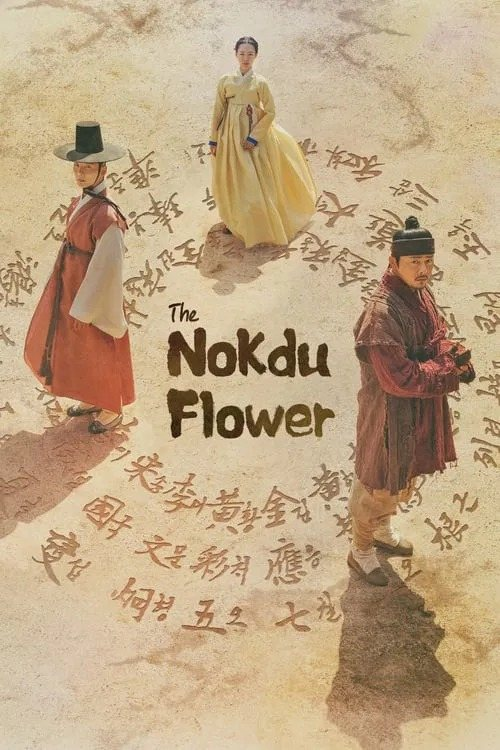 | **عهد جديد** — My Country: The New Age | 2019 | 8.3 | اكشن |
| 8 | 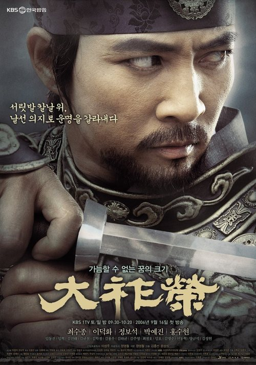 | **الملك داي جو** — Dae Jo Yeong | 2006 | 8.3 | دراما |
| 9 | 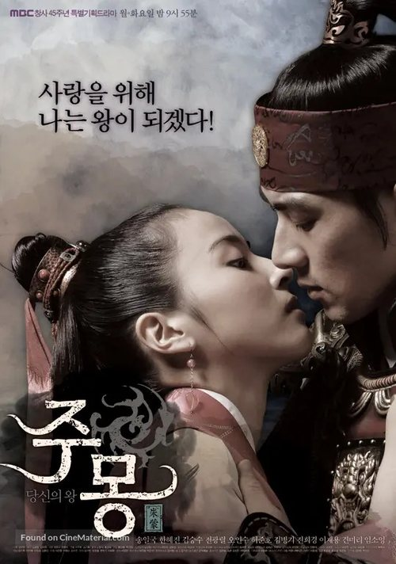 | **جومونك** — Jumong | 2006 | 8.3 | مغامرة |
| 10 | 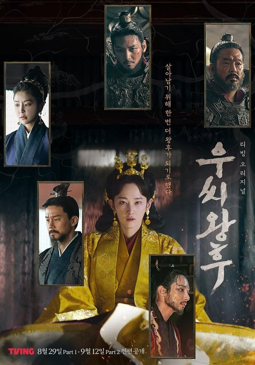 | **الملكة وو** — Queen Woo | 2024 | 8.1 | اكشن |
| 11 | 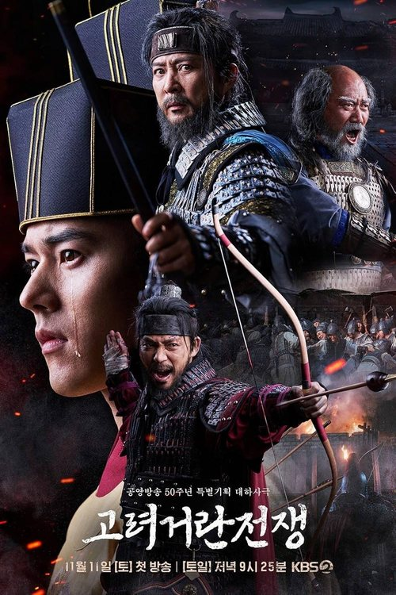 | **حرب غوريو وخيتان** — Goryeo-Khitan War | 2023 | 8.1 | اكشن |
| 12 | 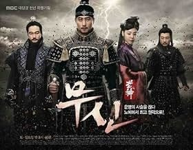 | **الجندي** — God of War (Musin) | 2012 | 8.1 | تاريخي |
| 13 | 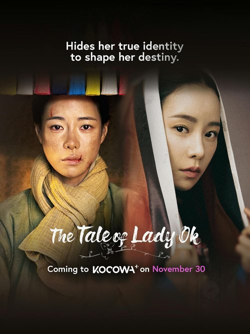 | **The Tale of Lady Ok** | 2024 | 8.0 | دراما |
| 14 | 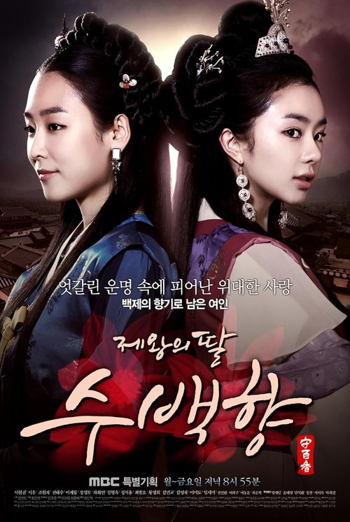 | **سو بيك هيانغ أبنة الملك** — King's Daughter, Soo Baek Hyang | 2013 | 8.0 | دراما |
| 15 | 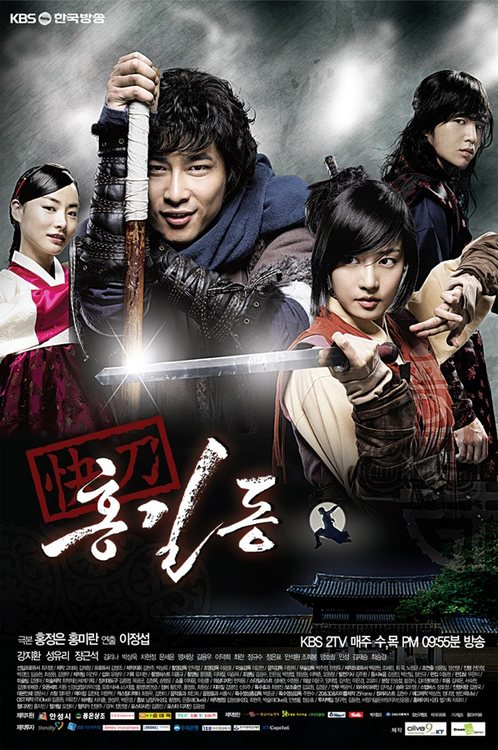 | **The Phantom Thief** — Iljimae | 2008 | 8.0 | اكشن |
| 16 | 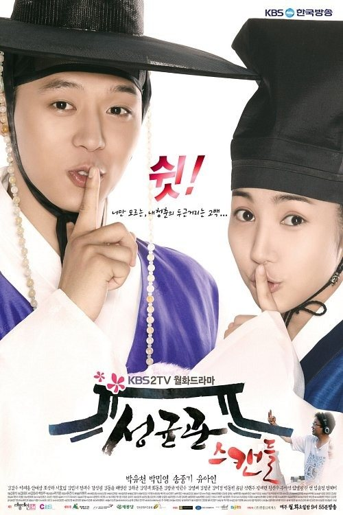 | **فضيحة سونغ كيونكوان** — Sungkyunkwan Scandal | 2010 | 7.8 | كوميدي |
| 17 | 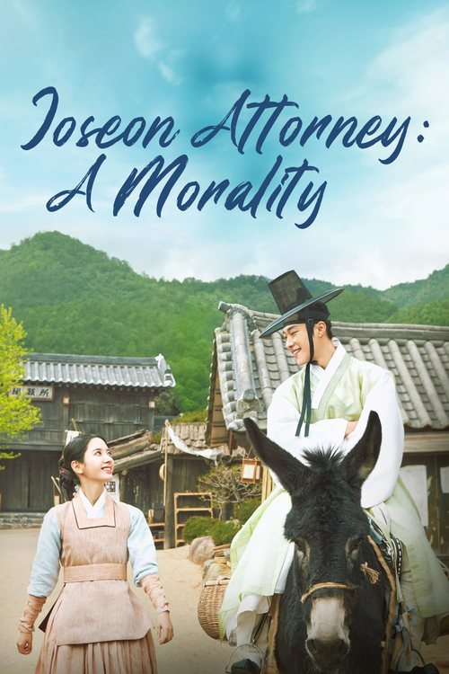 | **محامي جوسون: الفضيلة** — Joseon Attorney | 2023 | 7.7 | دراما |
| 18 | 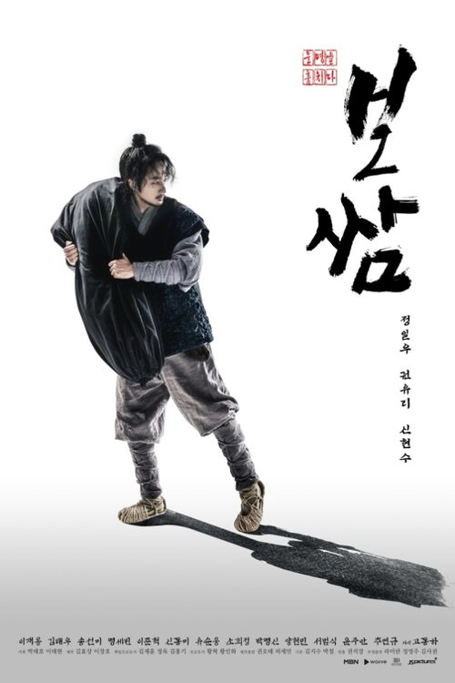 | **بوسام: سرقة القدر** — Bossam: Steal the Fate | 2021 | 7.7 | دراما |
| 19 | 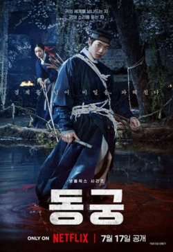 | **القصر الشرقي** — The East Palace | 2026 | 7.6 | اكشن |
| 20 | 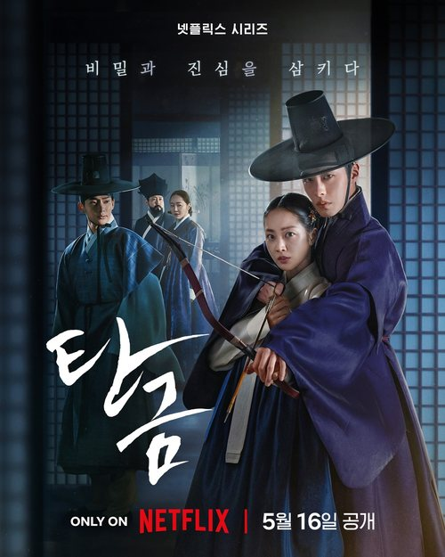 | **عزيزي هونغرانغ** — Dear Hongrang | 2025 | 7.6 | دراما |
| 21 | 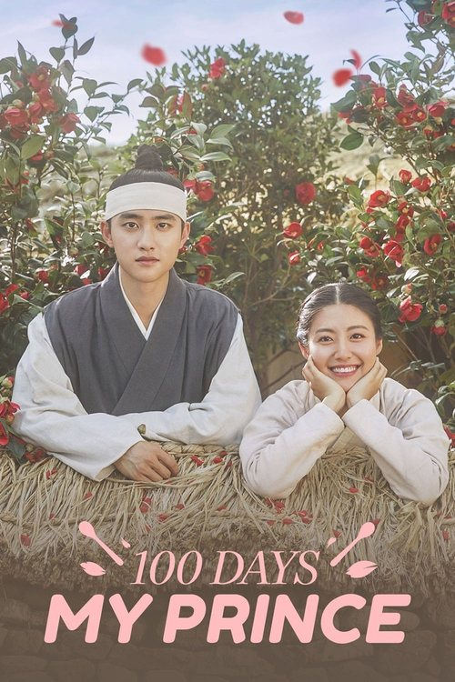 | **100 Days My Prince** | 2018 | 7.6 | تاريخي |
| 22 | 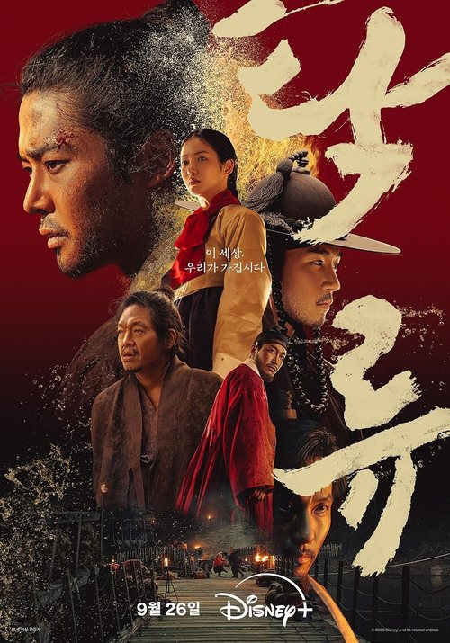 | **The Murky Stream** | 2025 | 7.5 | اكشن |
| 23 | 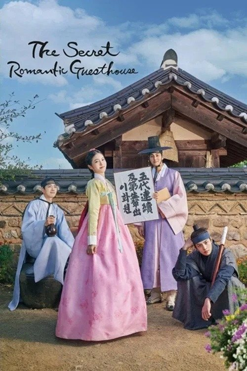 | **بيت ضيافة رومانسي** | 2023 | 7.5 | تاريخي |
| 24 | 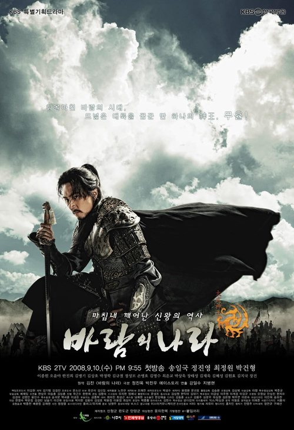 | **مملكة الرياح** — The Kingdom of the Winds | 2008 | 7.5 | دراما |
| 25 | 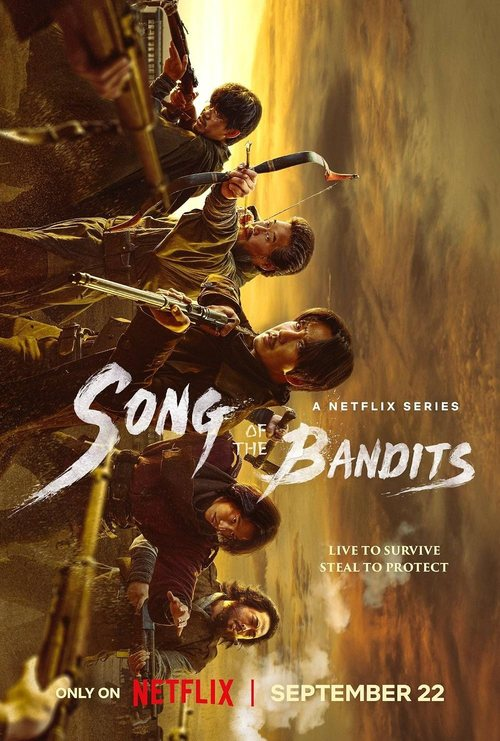 | **اغنية السيف** — Song of the Bandits | 2023 | 7.2 | اكشن |
| 26 | 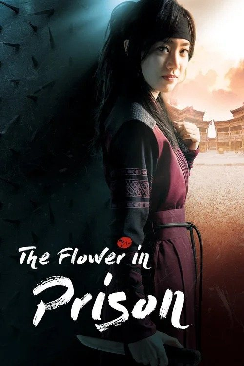 | **زهرة في السجن** — Flowers in Prison | 2016 | 7.2 | دراما |
| 27 | 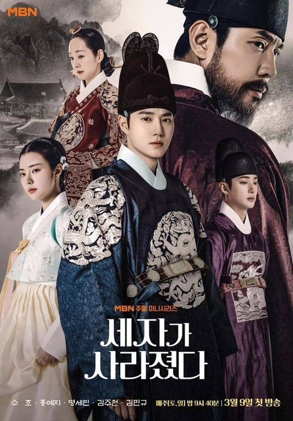 | **ولي العهد المفقود** — The Missing Crown Prince | 2024 | 6.9 | كوميدي |

---

## 🎯 شنو تشوف بعدين — مرتّبة حسب ذوقك انت

### 🥇 الثلاثة اللي لازم تشوفهن أول

**The Great Queen Seondeok** —  (2009) · ★8.6 · تاريخي  
**نفس عالم ستة تنانين وجومونك بالضبط.** ملحمة الملكة سيوندوك أول ملكة بتاريخ كوريا وصراعها مع ميشيل — 62 حلقة سياسة ومؤامرات من العيار الثقيل. إذا عجبتك الملاحم، هاي قمتهن.

**الإمبراطورة كي** — Empress Ki (2013) · ★8.4 · دراما  
**رحلة صعود من جارية لإمبراطورة الصين.** نفس نمط *سو بيك هيانغ* و*الملكة وو* اللي حبيتهن — امرأة تصعد بعالم رجال.

**قناع العروس** — Bridal Mask (Gaksital) (2012) · ★8.3 · اكشن  
**شفت إلجيماي (The Phantom Thief) — هذا أخوه الأكبر.** بطل مقنّع بفترة الاحتلال الياباني، بس أنضج وأقسى. تقييمه 8.3 ومستحق.

### 🥈 أعلى التقييمات اللي فاتتك

| | العمل | السنة | ⭐ | النوع | ملاحظة |
|---|-------|:----:|:--:|-------|--------|
| 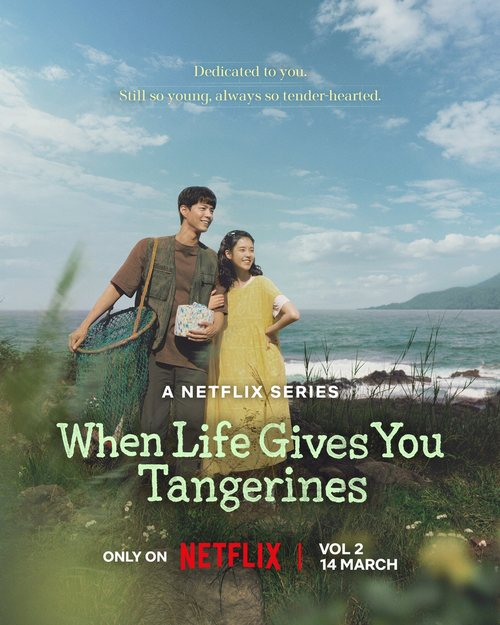 | **When Life Gives You Tangerines** | 2025 | 9.3 | دراما | الأعلى تقييماً بالقائمة كلها — بس انتبه: مو ساغوك، دراما عائلية معاصرة |
| 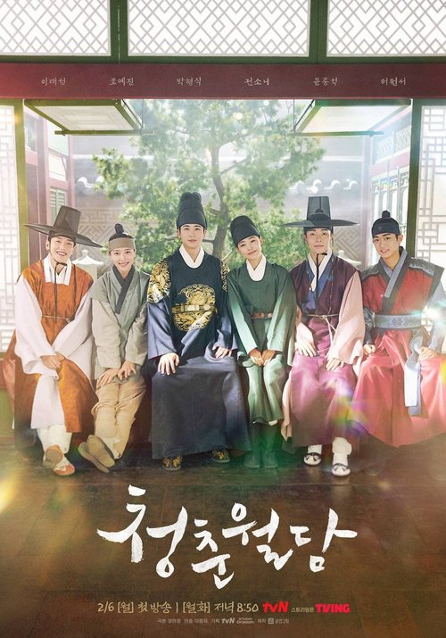 | **شبابنا المتفتح** | 2023 | 9.1 | دراما | أعلى ساغوك ما شفته — لغز وقصر ومؤامرة |
| 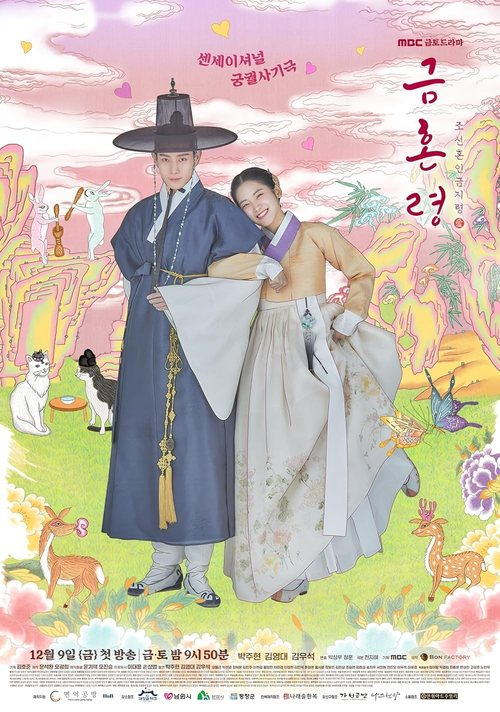 | **الزواج المحظور** | 2022 | 8.8 | تاريخي | كوميديا تاريخية بنفس روح *تحت مظلة الملكة* اللي حبيتها |
| 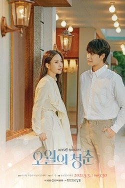 | **شباب مايو** | 2021 | 8.6 | دراما | مو تاريخي — أحداث انتفاضة غوانغجو 1980 |
| 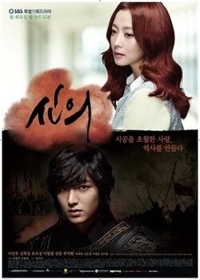 | **Faith** | 2012 | 8.6 | اكشن | سفر بالزمن لغوريو — أقرب للخيالي، خارج منطقتك المعتادة |
| 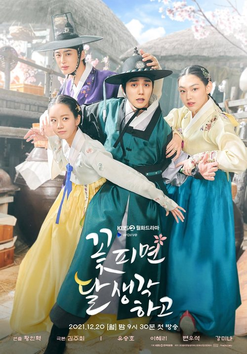 | **عندما تتفتح الأزهار، أفكر في القمر** | 2021 | 8.5 | دراما | جوسون بزمن منع الخمور — رومانسية ذكية |

### 🥉 إذا تحب تجرّب نوع جديد

| النوع | العمل المقترح كبداية | ⭐ | ليش هذا بالذات |
|-------|---------------------|:--:|----------------|
| **خيالي** | Haereul poomeun dal (2012) | 7.9 | ساغوك أصيل بس مضاف له سحر وشامانية — أسهل مدخل من موقعك |
| **كوميدي أخف** | امير السطوح (2012) | 8.2 | ولي عهد ينتقل لسيول الحديثة — مختلف كلياً عن اللي تشوفه |
| **رومانسي** | The Iron King (2010) | 7.4 | تأسيس مملكة غايا — رومانسي بس بقالب ملحمي يناسبك |

**نصيحة:** *الوحش: مطاردة قاتل في كوريا* (رقم 35) هو التصنيف الوحيد بالجريمة، بس هو **فلم وثائقي** عن سفاح حقيقي — مو مسلسل درامي. إذا تدور على جريمة درامية ما راح تلگاها بهاي القائمة.

---

## 📝 ملاحظات

- علّمت **#1 القصر الشرقي** — و**#2 The East Palace** هو نفس العمل بترجمة ثانية، فحسبته مرة وحدة.
- الأعمال المكرّرة الباقية (#40، #50، #78) ما علّمت أصولها، فهي بره حساب المشاهدة.
- **#24 بيت ضيافة رومانسي** و**#4 The Murky Stream** — علّمت إنك شفتهن، بس هما من الأعمال اللي ما گدرت أأكّد اسمها الأصلي. إذا تعرف اسمهن بالإنجليزي أو الكوري انطيني ياه وأكمّل وصفهن بالقائمة.

---

*تحديث: 2026-08-19 · 27/83 عمل · متوسط ★7.97*
